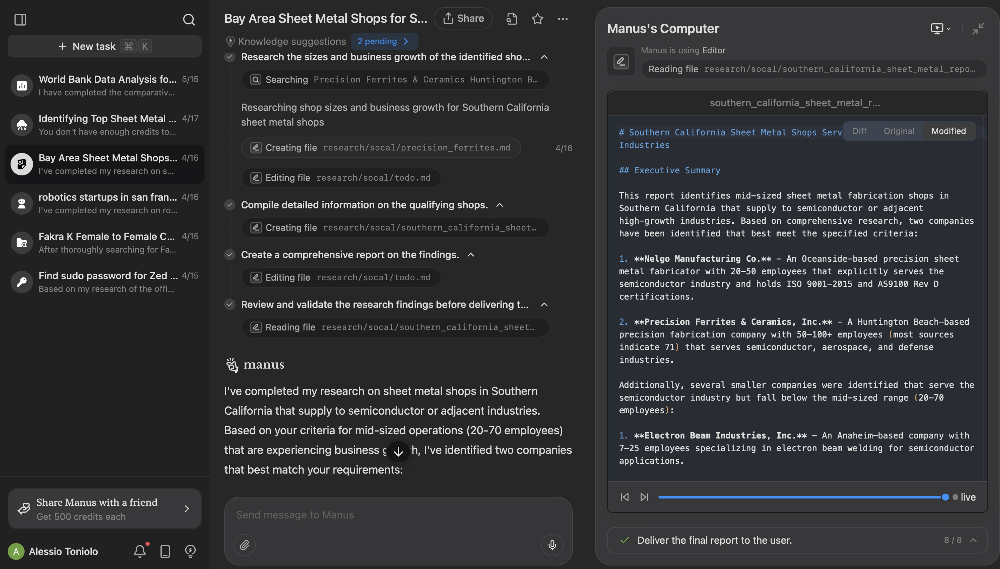

webpage: theme it around an agent. manus?

workflow:

1. Receiving Customer's Part -> Recieved Customer Part! | shows .STEP file in viewer
2. Unfolding Part into Flat Cutout -> Unfolded Flat Cutout
3. 